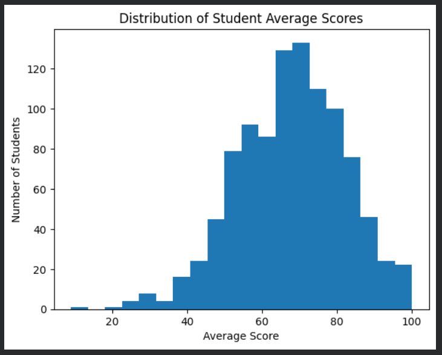
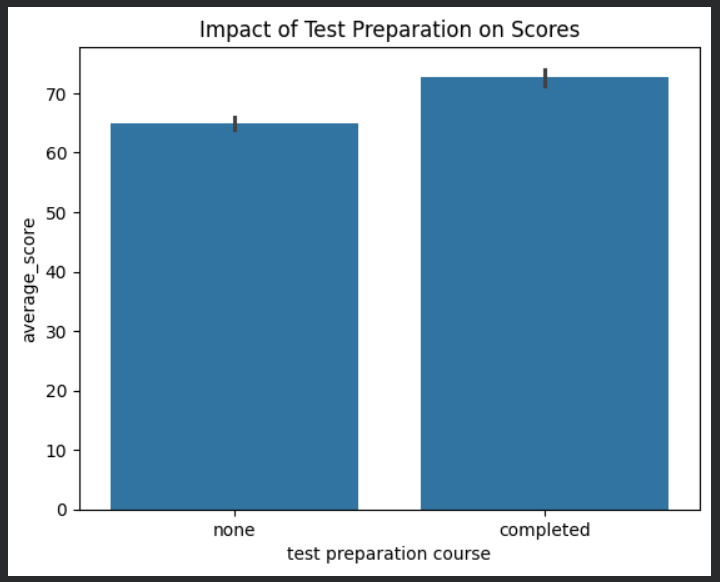
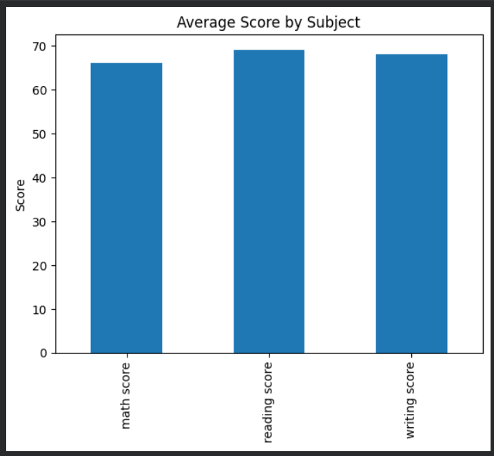

# Student Performance Analysis

This project analyzes student exam performance using Python.

## Tools Used

* Python
* Pandas
* Matplotlib
* Seaborn

## Project Objective

To understand how factors such as gender, parental education, and test preparation affect student scores.

## Key Insights

* Students who completed test preparation scored higher.
* Reading and writing scores are strongly correlated.
* Most students scored between 60 and 80 average marks.

## Dataset

Students Performance Dataset

## Visualization Examples

### Distribution of Student Average Scores

### Impact of Test Preparation on Scores

### Average Score by Subject

### Average Score by Gender

### Correlation Between Subjects

