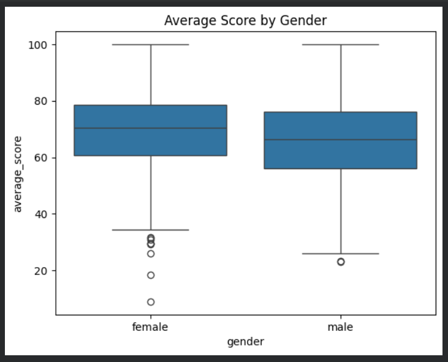
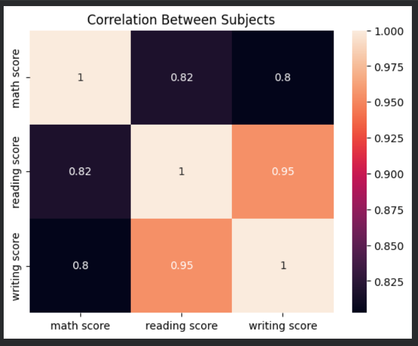

# Student Performance Analysis

## Project Overview
This project performs Exploratory Data Analysis (EDA) on a student performance dataset to understand patterns in academic scores.  
The goal is to analyze how different factors such as gender, parental education, and test preparation courses influence student exam performance.

The analysis uses Python and data visualization techniques to uncover meaningful insights from the dataset.

---

## Tools Used
- Python
- Pandas
- Matplotlib
- Seaborn
- Google Colab

---

## Project Objective
The objective of this project is to analyze student exam data and identify patterns that influence academic performance.

The analysis focuses on:
- Understanding score distribution among students
- Comparing performance across subjects
- Identifying the impact of test preparation courses
- Exploring relationships between exam scores

---

## Dataset
The dataset contains approximately **1000 student records** with demographic details and exam scores.

Main columns in the dataset include:

- Gender
- Parental level of education
- Lunch type
- Test preparation course
- Math score
- Reading score
- Writing score

The dataset helps analyze how different factors influence student academic outcomes.

---

## Visualization Examples

### Distribution of Student Average Scores

### Impact of Test Preparation on Scores

### Average Score by Subject

### Average Score by Gender

### Correlation Between Subjects

---

## Key Insights

- Students who completed the **test preparation course** scored higher on average.
- **Reading and writing scores** show a strong positive correlation.
- Most students scored between **60 and 80 average marks**.
- Math scores are slightly lower compared to reading and writing scores.

---

## Project Files

- `Student_Performance_Analysis.ipynb`  
  → Notebook containing the full data analysis and visualizations.

- `StudentsPerformance.csv`  
  → Dataset used for performing the analysis.

- `images/`  
  → Folder containing visualization screenshots used in this README.

---

## Conclusion

This analysis highlights how preparation programs and other factors can influence student academic performance.  
The insights from this dataset can help educators better understand performance patterns and design strategies to support student learning.

---

## Author
Pavani Mada
